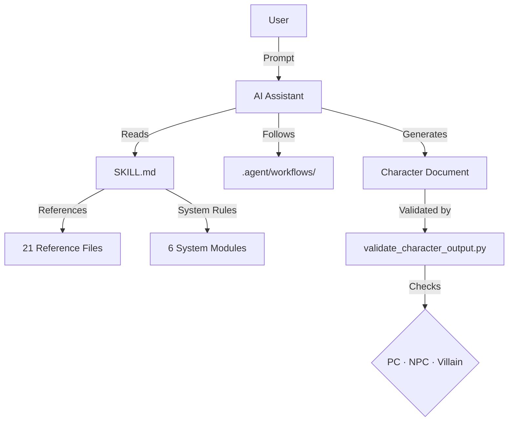

# 🎲 rpg-lore-weaver

> _An interactive AI skill that helps you craft deep backstories, complex motivations, and dramatic hooks for tabletop RPG characters._

**🇧🇷 Leia em Português ➡️ [README.pt-BR.md](README.pt-BR.md)**

---

## ❓ What Is This?

**rpg-lore-weaver** is a skill (a set of instructions) that you can install in AI assistants like **GitHub Copilot**, **Claude Code**, **Gemini Code Assist**, or **Cursor**. Once installed, the AI becomes a **character co-author** — guiding you through structured phases to turn a vague character idea into a fully realized persona with history, flaws, connections, and DM-ready hooks.

### Philosophy

> "You are the result of your story. Every event, every reaction, every decision shapes who you become."

The difference between a flat character and a memorable one is in the **details** — details that involve history.

---

## Supported Systems

Works with **any tabletop RPG**. Enriched modules included for:

| System                 | Module                              | Highlights                                                   |
| ---------------------- | ----------------------------------- | ------------------------------------------------------------ |
| **D&D 5e / 5.5e**      | `systems/dnd5e-rules.md`            | Backstory by class, Ideals/Bonds/Flaws, Inspiration Triggers |
| **Pathfinder 2e**      | `systems/pathfinder2e-rules.md`     | Edicts/Anathema, Ancestry/Heritage, Ancestry Feats           |
| **Daggerheart**        | `systems/daggerheart-rules.md`      | 9 classes with Background Questions, Experiences mechanic    |
| **Call of Cthulhu 7e** | `systems/coc-rules.md`              | 10 official backstory entries, Sanity, Key Connection        |
| **Tormenta 20**        | `systems/tormenta20-rules.md`       | 15 races, Origens, Devoção, Tormenta-specific questions      |
| **Ordem Paranormal**   | `systems/ordem-paranormal-rules.md` | 5 Elementos, NEX, O Outro Lado, horror prompts               |

The skill is system-agnostic at its core — it focuses on story, not mechanics.

---

## Features

- **🎭 Entity Type Selection** — Choose what you're creating: PC, NPC, or Villain — each has its own workflow
- **10 Pillars of Depth** — Origin, Family, Motivations, Personality, Ideals, Weaknesses, Decisions, Friends, Mentors, Rivals
- **Co-Authoring Experience** — The AI probes deeper, suggests contradictions, and offers creative choices
- **Vulnerability First** — Weaknesses create bonds, not strengths. The skill actively explores flaws
- **DM-Ready Hooks** — Every character comes with secrets, loose threads, and evolution arcs
- **6-Phase Flow** — Structured process from discovery to mechanical suggestions, with narrative-first design
- **🗡️ Villain Mode** — Dedicated 6-step workflow for creating memorable antagonists (Seed → Mirror → Plan → Cracks → Web → Escalation)
- **⚙️ Phase 6: The Gear** — Narratively justified mechanical suggestions (stats, skills, equipment) derived from backstory
- **NPC Quick Mode** — Rapid 3-pillar NPC creation for DMs who need characters _now_
- **Party Creation Mode** — Build interconnected character groups with shared history and dynamic tensions
- **System Conversion** — Port characters between RPG systems while preserving narrative identity

---

## 📦 What's Inside

```
rpg-lore-weaver/
├── SKILL.md                              Main skill instructions (the AI reads this)
├── CHANGELOG.md                          Version history
├── CONTRIBUTING.md                       How to contribute
├── .agent/workflows/                     Quick-start workflows (slash commands)
│   ├── create-rpg-character.md           /create-rpg-character — Full PC creation
│   ├── create-rpg-npc.md                 /create-rpg-npc — NPC Quick Mode
│   ├── create-rpg-villain.md             /create-rpg-villain — Villain Mode
│   └── create-rpg-party.md              /create-rpg-party — Party creation
├── references/                           Knowledge base (21 files)
│   ├── techniques-and-examples.md        Creation techniques & few-shot examples
│   ├── 10-pillars-deep-dive.md           Deep guide for each pillar
│   ├── formatting-templates.md           Progress tracker, recaps & output validation
│   ├── system-prompts.md                 System-specific prompts
│   ├── npc-quick-mode.md                 3-pillar tiered NPC creation
│   ├── villain-mode.md                   V1-V6 villain/antagonist workflow
│   ├── error-handling.md                 Error recovery & technical notes
│   ├── character-archetypes.md           20 narrative archetypes
│   ├── random-tables.md                  Random inspiration tables
│   ├── session-evolution.md              Multi-session character evolution
│   ├── creative-decision-log.md          Track creative decisions
│   ├── party-creation-mode.md            Group character creation
│   ├── system-conversion.md              Convert between RPG systems
│   ├── resource-index.md                 Central index of all resources
│   └── reference-*.md (6 files)          Deep library (psychology, culture, dialogue, etc.)
├── systems/                              System-specific rules (6 systems)
│   └── <system>-rules.md                 D&D 5e, PF2e, Daggerheart, CoC, T20, OP
├── examples/                             Complete character samples (8 files)
│   ├── sample-character-dnd.md           Kael Thornwood (D&D 5e)
│   ├── sample-character-pathfinder2e.md  Seraphine Duskwalker (Pathfinder 2e)
│   ├── sample-character-daggerheart.md   Ren Ashveil (Daggerheart)
│   ├── sample-character-coc.md           Margaret Calloway (Call of Cthulhu 7e)
│   ├── sample-character-tormenta20.md    Ynara Solqueimada (Tormenta 20)
│   ├── sample-character-ordem-paranormal.md  Lucas Ferreira (Ordem Paranormal)
│   ├── sample-npc-quick.md               Dorin Halfhammer (NPC at 3 tiers)
│   └── sample-villain.md                 Verath Sunhollow (D&D 5e villain)
├── scripts/                              Maintenance & validation tools
│   ├── validate_character_output.py      Validates characters (22 checks + villain mode)
│   ├── export_character.py               Exports to JSON/Markdown/Homebrewery
│   ├── compile_skill.py                  Compiles single-file manual (3 profiles)
│   ├── quality_gate.py                   Continuous quality checks + frontmatter validation
│   ├── test_compile_skill.py             Structural tests for compile_skill (14 tests)
│   ├── test_character_tools.py           Regression tests for character tools
│   ├── test_lib_utils.py                 Unit tests for lib_utils
│   └── lib_utils.py                      Shared utilities
└── .github/workflows/
    └── quality-gate.yml                  CI/CD pipeline (GitHub Actions)
```

---

## 🛠️ Prerequisites

To use the **scripts** (optional but recommended):

- **Python 3.9+** installed on your system
- No external dependencies (standard library only)

To use the **skill itself**:

- Access to an AI Assistant (GitHub Copilot, Claude, ChatGPT, Gemini, etc.)

---

## Installation

### 🤖 Method 1: AI Agent (Recommended)

Copy the `rpg-lore-weaver` folder into your agent's skills directory. The AI will load files **on demand**, keeping context usage minimal.

| Agent                  | Skills Folder                    | Free Plan?                 |
| ---------------------- | -------------------------------- | -------------------------- |
| **GitHub Copilot**     | `.github/skills/rpg-lore-weaver` | ✅ Yes (2k completions/mo) |
| **Gemini Code Assist** | `.gemini/skills/rpg-lore-weaver` | ✅ Yes (unlimited)         |
| **Cursor**             | Open folder in Cursor            | ✅ Yes (limited)           |
| **Windsurf (Codeium)** | Open folder in Windsurf          | ✅ Yes (unlimited)         |
| **Continue.dev**       | Open folder in VS Code           | ✅ Yes (open source)       |
| **Claude Code**        | `.claude/skills/rpg-lore-weaver` | ❌ Paid only               |

```bash
# Example: GitHub Copilot
cp -r rpg-lore-weaver .github/skills/rpg-lore-weaver

# Example: Gemini Code Assist
cp -r rpg-lore-weaver .gemini/skills/rpg-lore-weaver
```

```powershell
# PowerShell
Copy-Item -Recurse -Force .\rpg-lore-weaver .\.github\skills\rpg-lore-weaver
```

### 📋 Method 2: Manual (Any AI — ChatGPT, Gemini, Claude, etc.)

If your AI doesn't support skills, compile a manual and **copy-paste** it into the chat.

The compiler has **3 profiles** to fit your AI's context window:

| Profile  | Tokens | Best For                                      |
| -------- | ------ | --------------------------------------------- |
| `full`   | ~113k  | Gemini (1M context), Google AI Studio         |
| `system` | ~24k   | ChatGPT, Claude — includes only YOUR system   |
| `micro`  | ~9k    | Small context models, GPT-3.5, quick sessions |

```bash
# Full manual (all systems, all references)
python scripts/compile_skill.py

# System-specific (D&D only, 78% smaller!)
python scripts/compile_skill.py --profile system --system dnd5e

# Minimal (SKILL.md + system prompts only)
python scripts/compile_skill.py --profile micro
```

**System aliases**: `dnd`, `pf2e`, `dh`, `coc`, `t20`, `op`

**Steps:**

1. Run the compile command for your profile
2. Copy the generated `.md` file content
3. Paste into your AI chat (ChatGPT, Gemini, Claude, etc.)

> 💡 **Best free web option**: [Google AI Studio](https://aistudio.google.com/) — free, 1M token context, handles the full manual easily.

---

## How to Use

### Quick Start with Workflows

If your agent supports **slash commands** (`.agent/workflows/`), you can use these shortcuts:

| Command                 | What it does                                  |
| ----------------------- | --------------------------------------------- |
| `/create-rpg-character` | Full 6-phase PC creation with all 10 pillars  |
| `/create-rpg-npc`       | Quick NPC using 3-pillar tiered system        |
| `/create-rpg-villain`   | Villain creation following the V1-V6 workflow |
| `/create-rpg-party`     | Interconnected party with shared history      |

### Free-Form Prompts

You can also just start a conversation with your AI:

- _"Help me create an RPG character backstory"_
- _"I need lore for my D&D character"_
- _"Develop a personality for my NPC"_
- _"Create a villain for my Pathfinder campaign"_
- _"My character feels flat, help me fix it"_
- _"Build a deep backstory for my Pathfinder rogue"_

The AI will first ask what you're creating (PC, NPC, or Villain), then guide you through 6 phases — asking questions and building the character with you.

---

## Examples

Check the `examples/` folder for complete sample characters:

| Character                                                             | System             | Concept                                            |
| --------------------------------------------------------------------- | ------------------ | -------------------------------------------------- |
| **[Kael Thornwood](examples/sample-character-dnd.md)**                | D&D 5e             | Tiefling druid hiding his infernal heritage        |
| **[Seraphine Duskwalker](examples/sample-character-pathfinder2e.md)** | Pathfinder 2e      | Champion of Sarenrae questioning her faith         |
| **[Ren Ashveil](examples/sample-character-daggerheart.md)**           | Daggerheart        | Faun healer addicted to absorbing others' pain     |
| **[Margaret Calloway](examples/sample-character-coc.md)**             | Call of Cthulhu 7e | Widowed librarian drawn to Lovecraftian horrors    |
| **[Ynara Solqueimada](examples/sample-character-tormenta20.md)**      | Tormenta 20        | Lefou tracker hunting the storm inside her         |
| **[Lucas Ferreira](examples/sample-character-ordem-paranormal.md)**   | Ordem Paranormal   | Radio host who heard a frequency from O Outro Lado |
| **[Dorin Halfhammer](examples/sample-npc-quick.md)**                  | Any                | NPC Quick Mode at 3 depth tiers                    |
| **[Verath Sunhollow](examples/sample-villain.md)**                    | D&D 5e             | Grief-corrupted druid villain (V1-V6 format)       |

---

## 🏗️ Architecture

How the skill is structured (see **[docs/ARCHITECTURE.md](docs/ARCHITECTURE.md)** for details):



---

## 🧪 Quality Assurance

The project includes a comprehensive quality gate that runs automatically via **GitHub Actions** on every push and PR:

```bash
# Run locally
python scripts/quality_gate.py
```

**Checks performed:**

- Unit tests (`test_lib_utils`, `test_character_tools`, `test_compile_skill` — 34+ tests)
- SKILL.md line count enforcement (≤ 500 lines)
- Manual compilation
- Character example validation (PC + NPC + Villain modes)
- Reference frontmatter hygiene (description & tags)

---

## Troubleshooting

### The AI stops generating in the middle of a section

> **Fix**: Simply type "continue" or "go on". The character document can be long, and AI models have output limits.

### The AI forgets a rule from Phase 1

> **Fix**: Remind it gently: "Remember the Understanding Lock we established in Phase 1." The skill is designed to prevent this, but context windows vary.

### "I don't have access to file X"

> **Fix**: If using the Manual Mode (`rpg-lore-weaver-manual.md`), ensure you pasted the _entire_ file content. If using Copilot/Claude, ensure the skill folder is correctly placed in `.github/skills` or `.claude/skills`.

---

## License

Free to use, share, and modify. Share it with your campaign group!

Created by David.
