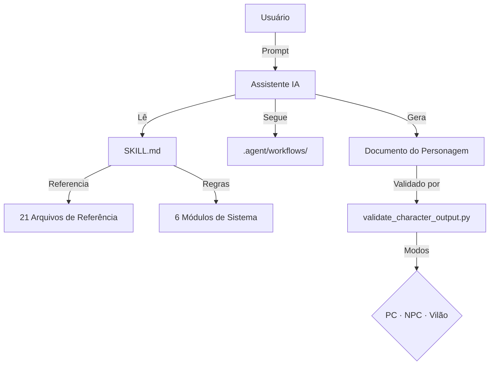

# 🎲 rpg-lore-weaver

> _Uma skill interativa de IA que ajuda você a criar backstories profundas, motivações complexas e ganchos dramáticos para personagens de RPG de mesa._

**🇺🇸 Read in English ➡️ [README.md](README.md)**

---

## ❓ O Que é Isso?

**rpg-lore-weaver** é uma skill (um conjunto de instruções) que você pode instalar em assistentes de IA como **GitHub Copilot**, **Claude Code**, **Gemini Code Assist** ou **Cursor**. Uma vez instalada, a IA se torna um **co-autor de personagem** — guiando você por fases estruturadas para transformar uma ideia vaga em uma persona completa com história, falhas, conexões e ganchos prontos para o mestre.

### Filosofia

> "Você é o resultado da sua história. Cada evento, cada reação, cada decisão molda quem você se torna."

A diferença entre um personagem raso e um memorável está nos **detalhes** que envolvem história.

---

## Sistemas Suportados

Funciona com **qualquer RPG de mesa**. Módulos enriquecidos inclusos para:

| Sistema                | Módulo                              | Destaques                                                          |
| ---------------------- | ----------------------------------- | ------------------------------------------------------------------ |
| **D&D 5e / 5.5e**      | `systems/dnd5e-rules.md`            | Backstory por classe, Ideais/Vínculos/Falhas, Inspiration Triggers |
| **Pathfinder 2e**      | `systems/pathfinder2e-rules.md`     | Edicts/Anathema, Ancestry/Heritage, Ancestry Feats                 |
| **Daggerheart**        | `systems/daggerheart-rules.md`      | 9 classes com Background Questions, mecânica de Experiences        |
| **Call of Cthulhu 7e** | `systems/coc-rules.md`              | 10 entradas oficiais de backstory, Sanidade, Key Connection        |
| **Tormenta 20**        | `systems/tormenta20-rules.md`       | 15 raças, Origens, Devoção, perguntas específicas                  |
| **Ordem Paranormal**   | `systems/ordem-paranormal-rules.md` | 5 Elementos, NEX, O Outro Lado, prompts de horror                  |

A skill é agnóstica de sistema no seu core — foca na história, não na mecânica.

---

## Funcionalidades

- **🎭 Seleção de Tipo de Entidade** — Escolha o que vai criar: PC, NPC ou Vilão — cada um tem seu próprio fluxo
- **10 Pilares de Profundidade** — Origem, Família, Motivações, Personalidade, Ideais, Fraquezas, Decisões, Amigos, Mentores, Rivais
- **Experiência de Co-Autoria** — A IA investiga mais fundo, sugere contradições e oferece escolhas criativas
- **Vulnerabilidade Primeiro** — Fraquezas criam vínculos, não forças. A skill explora falhas ativamente
- **Ganchos Prontos pro Mestre** — Cada personagem vem com segredos, pontas soltas e arcos de evolução
- **Fluxo em 6 Fases** — Processo estruturado do discovery às sugestões mecânicas, com design narrativa-primeiro
- **🗡️ Modo Vilão** — Fluxo dedicado em 6 etapas para criar antagonistas memoráveis (Semente → Espelho → Plano → Rachaduras → Teia → Escalação)
- **⚙️ Fase 6: A Engrenagem** — Sugestões mecânicas narrativamente justificadas (stats, perícias, equipamento) derivadas da backstory
- **Modo NPC Rápido** — Criação rápida de NPCs em 3 pilares, para mestres com pressa
- **Modo Criação em Grupo** — Crie personagens interconectados com história compartilhada e tensões dinâmicas
- **Conversão entre Sistemas** — Converta personagens entre sistemas de RPG mantendo a identidade narrativa

---

## 📦 O Que Há Dentro

```
rpg-lore-weaver/
├── SKILL.md                              Instruções principais (a IA lê este arquivo)
├── CHANGELOG.md                          Histórico de versões
├── CONTRIBUTING.md                       Como contribuir
├── .agent/workflows/                     Workflows de atalho (slash commands)
│   ├── create-rpg-character.md           /create-rpg-character — Criação completa de PC
│   ├── create-rpg-npc.md                 /create-rpg-npc — Modo NPC Rápido
│   ├── create-rpg-villain.md             /create-rpg-villain — Modo Vilão
│   └── create-rpg-party.md              /create-rpg-party — Criação de grupo
├── references/                           Base de conhecimento (21 arquivos)
│   ├── techniques-and-examples.md        Técnicas de criação & exemplos few-shot
│   ├── 10-pillars-deep-dive.md           Guia detalhado de cada pilar
│   ├── formatting-templates.md           Tracker de progresso, recaps & validação
│   ├── system-prompts.md                 Prompts específicos por sistema
│   ├── npc-quick-mode.md                 Criação NPC em 3 pilares
│   ├── villain-mode.md                   Workflow V1-V6 para vilões/antagonistas
│   ├── error-handling.md                 Recuperação de erros & notas técnicas
│   ├── character-archetypes.md           20 arquétipos narrativos
│   ├── random-tables.md                  Tabelas aleatórias de inspiração
│   ├── session-evolution.md              Evolução entre sessões
│   ├── creative-decision-log.md          Log de decisões criativas
│   ├── party-creation-mode.md            Criação em grupo
│   ├── system-conversion.md              Conversão entre sistemas
│   ├── resource-index.md                 Índice central de recursos
│   └── reference-*.md (6 arquivos)       Biblioteca profunda (psicologia, cultura, etc.)
├── systems/                              Regras por sistema (6 sistemas)
│   └── <sistema>-rules.md                D&D 5e, PF2e, Daggerheart, CoC, T20, OP
├── examples/                             Personagens de exemplo completos (8 arquivos)
│   ├── sample-character-dnd.md           Kael Thornwood (D&D 5e)
│   ├── sample-character-pathfinder2e.md  Seraphine Duskwalker (Pathfinder 2e)
│   ├── sample-character-daggerheart.md   Ren Ashveil (Daggerheart)
│   ├── sample-character-coc.md           Margaret Calloway (Call of Cthulhu 7e)
│   ├── sample-character-tormenta20.md    Ynara Solqueimada (Tormenta 20)
│   ├── sample-character-ordem-paranormal.md  Lucas Ferreira (Ordem Paranormal)
│   ├── sample-npc-quick.md               Dorin Halfhammer (NPC em 3 níveis)
│   └── sample-villain.md                 Verath Sunhollow (Vilão D&D 5e)
├── scripts/                              Ferramentas de manutenção & validação
│   ├── validate_character_output.py      Validador (22 checks + modo vilão)
│   ├── export_character.py               Exporta para JSON/Markdown/Homebrewery
│   ├── compile_skill.py                  Compila manual em arquivo único (3 perfis)
│   ├── quality_gate.py                   Quality checks + validação de frontmatter
│   ├── test_compile_skill.py             Testes estruturais do compilador (14 testes)
│   ├── test_character_tools.py           Testes de regressão
│   ├── test_lib_utils.py                 Testes unitários para lib_utils
│   └── lib_utils.py                      Utilidades compartilhadas
└── .github/workflows/
    └── quality-gate.yml                  Pipeline CI/CD (GitHub Actions)
```

---

## 🛠️ Pré-requisitos

Para usar os **scripts** (opcional, mas recomendado):

- **Python 3.9+** instalado no seu sistema
- Nenhuma dependência externa (apenas biblioteca padrão)

Para usar a **skill em si**:

- Acesso a um Assistente de IA (GitHub Copilot, Claude, ChatGPT, Gemini, etc.)

---

## Instalação

### 🤖 Método 1: Agente de IA (Recomendado)

Copie a pasta `rpg-lore-weaver` para o diretório de skills do seu agente. A IA carrega arquivos **sob demanda**, minimizando uso de contexto.

| Agente                 | Pasta de Skills                  | Plano Gratuito?             |
| ---------------------- | -------------------------------- | --------------------------- |
| **GitHub Copilot**     | `.github/skills/rpg-lore-weaver` | ✅ Sim (2k completions/mês) |
| **Gemini Code Assist** | `.gemini/skills/rpg-lore-weaver` | ✅ Sim (ilimitado)          |
| **Cursor**             | Abrir pasta no Cursor            | ✅ Sim (limitado)           |
| **Windsurf (Codeium)** | Abrir pasta no Windsurf          | ✅ Sim (ilimitado)          |
| **Continue.dev**       | Abrir pasta no VS Code           | ✅ Sim (open source)        |
| **Claude Code**        | `.claude/skills/rpg-lore-weaver` | ❌ Apenas pago              |

```bash
# Exemplo: GitHub Copilot
cp -r rpg-lore-weaver .github/skills/rpg-lore-weaver

# Exemplo: Gemini Code Assist
cp -r rpg-lore-weaver .gemini/skills/rpg-lore-weaver
```

```powershell
# PowerShell
Copy-Item -Recurse -Force .\rpg-lore-weaver .\.github\skills\rpg-lore-weaver
```

### 📋 Método 2: Manual (Qualquer IA — ChatGPT, Gemini, Claude, etc.)

Se sua IA não suporta skills, compile um manual e **copie e cole** no chat.

O compilador tem **3 perfis** para caber na janela de contexto da sua IA:

| Perfil   | Tokens | Indicado Para                                          |
| -------- | ------ | ------------------------------------------------------ |
| `full`   | ~113k  | Gemini (1M de contexto), Google AI Studio              |
| `system` | ~24k   | ChatGPT, Claude — inclui apenas O SEU sistema          |
| `micro`  | ~9k    | Modelos com contexto pequeno, GPT-3.5, sessões rápidas |

```bash
# Manual completo (todos os sistemas e referências)
python scripts/compile_skill.py

# Específico por sistema (só D&D, 78% menor!)
python scripts/compile_skill.py --profile system --system dnd5e

# Mínimo (SKILL.md + prompts de sistema apenas)
python scripts/compile_skill.py --profile micro
```

**Aliases de sistema**: `dnd`, `pf2e`, `dh`, `coc`, `t20`, `op`

**Passos:**

1. Execute o comando de compilação para o seu perfil
2. Copie o conteúdo do arquivo `.md` gerado
3. Cole no chat da sua IA (ChatGPT, Gemini, Claude, etc.)

> 💡 **Melhor opção web gratuita**: [Google AI Studio](https://aistudio.google.com/) — gratuito, 1M tokens de contexto, comporta o manual completo tranquilamente.

---

## Como Usar

### Início Rápido com Workflows

Se seu agente suporta **slash commands** (`.agent/workflows/`), use estes atalhos:

| Comando                 | O que faz                                                 |
| ----------------------- | --------------------------------------------------------- |
| `/create-rpg-character` | Criação completa de PC em 6 fases com todos os 10 pilares |
| `/create-rpg-npc`       | NPC rápido usando o sistema de 3 pilares                  |
| `/create-rpg-villain`   | Criação de vilão seguindo o workflow V1-V6                |
| `/create-rpg-party`     | Grupo interconectado com história compartilhada           |

### Prompts Livres

Você também pode simplesmente iniciar uma conversa com sua IA:

- _"Me ajuda a criar a backstory do meu personagem de RPG"_
- _"Preciso de lore pro meu personagem de D&D"_
- _"Desenvolve uma personalidade pro meu NPC"_
- _"Cria um vilão pra minha campanha de Pathfinder"_
- _"Meu personagem tá raso, me ajuda a dar profundidade"_
- _"Cria uma backstory rica pro meu ladino de Pathfinder"_

A IA vai primeiro perguntar o que você quer criar (PC, NPC ou Vilão), depois te guiar por 6 fases — fazendo perguntas e construindo o personagem junto com você.

---

## Exemplos

Confira a pasta `examples/` para personagens de exemplo completos:

| Personagem                                                            | Sistema            | Conceito                                                |
| --------------------------------------------------------------------- | ------------------ | ------------------------------------------------------- |
| **[Kael Thornwood](examples/sample-character-dnd.md)**                | D&D 5e             | Druida tiefling escondendo sua herança infernal         |
| **[Seraphine Duskwalker](examples/sample-character-pathfinder2e.md)** | Pathfinder 2e      | Champion de Sarenrae questionando sua fé                |
| **[Ren Ashveil](examples/sample-character-daggerheart.md)**           | Daggerheart        | Curandeiro fauno viciado em absorver dor alheia         |
| **[Margaret Calloway](examples/sample-character-coc.md)**             | Call of Cthulhu 7e | Bibliotecária viúva atraída por horrores Lovecraftianos |
| **[Ynara Solqueimada](examples/sample-character-tormenta20.md)**      | Tormenta 20        | Rastreadora Lefou caçando a tempestade dentro dela      |
| **[Lucas Ferreira](examples/sample-character-ordem-paranormal.md)**   | Ordem Paranormal   | Radialista que ouviu uma frequência de O Outro Lado     |
| **[Dorin Halfhammer](examples/sample-npc-quick.md)**                  | Qualquer           | NPC Quick Mode em 3 níveis de profundidade              |
| **[Verath Sunhollow](examples/sample-villain.md)**                    | D&D 5e             | Druida corrompido pelo luto (formato V1-V6)             |

---

## 🏗️ Arquitetura

Como a skill é estruturada (veja **[docs/ARCHITECTURE.md](docs/ARCHITECTURE.md)** para detalhes):



---

## 🧪 Garantia de Qualidade

O projeto inclui um quality gate abrangente que roda automaticamente via **GitHub Actions** em cada push e PR:

```bash
# Rodar localmente
python scripts/quality_gate.py
```

**Checks realizados:**

- Testes unitários (`test_lib_utils`, `test_character_tools`, `test_compile_skill` — 34+ testes)
- Limite de linhas do SKILL.md (≤ 500)
- Compilação do manual
- Validação dos exemplos de personagem (modos PC + NPC + Vilão)
- Higiene de frontmatter nas referências (description & tags)

---

## Solução de Problemas

### A IA para de gerar no meio de uma seção

> **Solução**: Digite "continue" ou "prossiga". O documento do personagem é longo e modelos de IA têm limites de saída.

### A IA esquece uma regra da Fase 1

> **Solução**: Lembre-a gentilmente: "Lembre-se do Understanding Lock que estabelecemos na Fase 1." A skill é projetada para evitar isso, mas janelas de contexto variam.

### "Eu não tenho acesso ao arquivo X"

> **Solução**: Se estiver usando o Modo Manual (`rpg-lore-weaver-manual.md`), certifique-se de ter colado o conteúdo _inteiro_. Se usar Copilot/Claude, verifique se a pasta da skill está em `.github/skills` ou `.claude/skills`.

---

## Licença

Livre para usar, compartilhar e modificar. Manda no grupo da campanha!

Criado por David.
