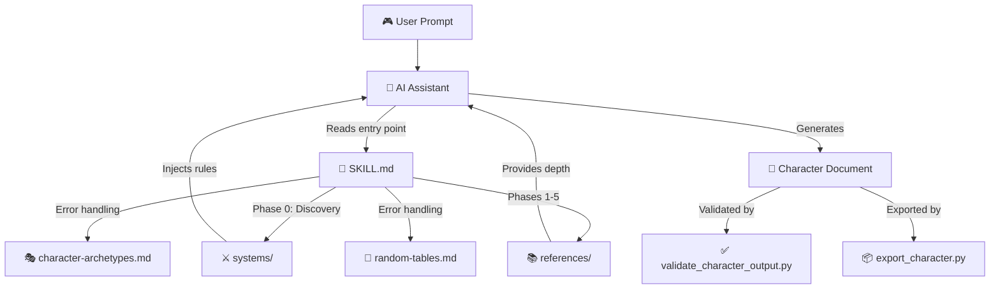
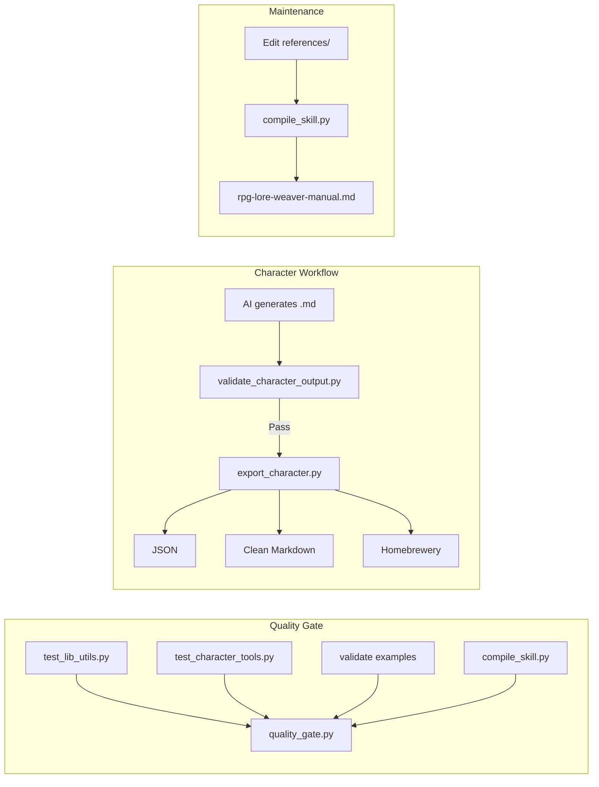

# Architecture & Data Flow

This document explains how `rpg-lore-weaver` works under the hood — its components, design decisions, and maintenance processes.

---

## 1. System Overview

---

## 2. Component Architecture

### Core Layer

| Component                      | Role                                                                             | Size       | Loaded    |
| ------------------------------ | -------------------------------------------------------------------------------- | ---------- | --------- |
| `SKILL.md`                     | Entry point. Defines the 6-phase workflow, 10 pillars, gates, and error handling | ≤500 lines | Always    |
| `references/resource-index.md` | Master index of all bundled resources                                            | ~60 lines  | On demand |

### Knowledge Layer (`references/`)

| File                         | Purpose                                                                     | When Loaded               |
| ---------------------------- | --------------------------------------------------------------------------- | ------------------------- |
| `10-pillars-deep-dive.md`    | Extended theory for each pillar                                             | During phases, per-pillar |
| `techniques-and-examples.md` | Creative techniques (Cliché Launchpad, Real-World Inspiration, etc.)        | When player is stuck      |
| `system-prompts.md`          | Tone and vocabulary per RPG system                                          | After Discovery           |
| `formatting-templates.md`    | Progress tracker, recap, completion templates                               | Phase transitions         |
| `character-archetypes.md`    | 20 universal archetypes with combos                                         | Error recovery            |
| `random-tables.md`           | 8 d10 inspiration tables                                                    | Error recovery            |
| `session-evolution.md`       | Post-creation evolution guide                                               | Phase 5                   |
| `creative-decision-log.md`   | Template for tracking "why X over Y"                                        | Throughout                |
| `party-creation-mode.md`     | Group creation with shared history                                          | Discovery (if party)      |
| `system-conversion.md`       | Porting characters between systems                                          | On demand                 |
| `npc-quick-mode.md`          | Streamlined 3-pillar NPC creation                                           | Discovery (if NPC)        |
| `villain-mode.md`            | Dedicated 6-step villain/antagonist creation workflow                       | Discovery (if Villain)    |
| `reference-*.md` (6 files)   | Deep library on psychology, culture, dialogue, plot, body, character design | On demand by AI           |

### Rules Layer (`systems/`)

| File                        | System           | Key Content                                                    |
| --------------------------- | ---------------- | -------------------------------------------------------------- |
| `dnd5e-rules.md`            | D&D 5th Edition  | Backstory by class category, Ideals/Bonds/Flaws, Inspiration   |
| `pathfinder2e-rules.md`     | Pathfinder 2e    | Ancestries, Heritages, Edicts/Anathema, Ancestry Feats         |
| `daggerheart-rules.md`      | Daggerheart      | 9 classes with Background Questions & Connections, Experiences |
| `coc-rules.md`              | Call of Cthulhu  | 10 backstory entries with example tables, Key Connection       |
| `tormenta20-rules.md`       | Tormenta 20      | Raças, Origens, Devoção, Tormenta questions                    |
| `ordem-paranormal-rules.md` | Ordem Paranormal | 5 Elementos, NEX, O Outro Lado, Horror prompts                 |

### Tooling Layer (`scripts/`)

| Script                         | Purpose                                                | Input               | Output                      |
| ------------------------------ | ------------------------------------------------------ | ------------------- | --------------------------- |
| `validate_character_output.py` | 21 quality checks on character docs                    | `.md` file          | Pass/fail report            |
| `export_character.py`          | Export to JSON, Markdown, Homebrewery                  | `.md` file + format | Formatted output            |
| `compile_skill.py`             | Compile manual (single-file version)                   | Profile flag        | `rpg-lore-weaver-manual.md` |
| `quality_gate.py`              | Run all checks (tests + validation + compile)          | —                   | Pass/fail                   |
| `lib_utils.py`                 | Shared utilities (frontmatter parser, mojibake scorer) | —                   | Library                     |
| `test_lib_utils.py`            | Unit tests for lib_utils                               | —                   | Test results                |
| `test_character_tools.py`      | Regression tests for validator and exporter            | —                   | Test results                |

### Examples Layer (`examples/`)

| File                                   | System           | Character                         |
| -------------------------------------- | ---------------- | --------------------------------- |
| `sample-character-dnd.md`              | D&D 5e           | Kael Thornwood (tiefling druid)   |
| `sample-character-daggerheart.md`      | Daggerheart      | Ren Ashveil (faun healer)         |
| `sample-character-tormenta20.md`       | Tormenta 20      | Ynara Solqueimada (lefou tracker) |
| `sample-character-ordem-paranormal.md` | Ordem Paranormal | Lucas Ferreira (radio host)       |
| `sample-npc-quick.md`                  | System-agnostic  | Dorin Halfhammer (3 tiers)        |

---

## 3. Design Decisions

### Why 10 Pillars?

Human character complexity maps naturally to 10 dimensions. Fewer pillars produce flat characters; more create cognitive overload. The 10 pillars divide cleanly into 5 thematic phases:

- **Where they came from** (Origin, Family) — establishes roots
- **What drives them** (Motivations, Personality, Ideals) — creates engine
- **What broke them** (Weaknesses, Decisions) — builds empathy
- **Who shaped them** (Friends, Mentors, Rivals) — adds context
- **Who they're becoming** (Evolution) — plants future seeds

### Why 6 Phases (not all at once)?

Progressive disclosure prevents overwhelm. Each phase builds on the previous, creating a narrative snowball effect where later details feel _inevitable_ rather than arbitrary. Phase 6 (The Gear) bridges narrative and mechanics, ensuring character sheets are justified by story.

### Why the Understanding Lock?

Without an explicit confirmation gate, the AI often assumes alignment with the user and drifts from the original intent. The lock forces both parties to synchronize before investing effort.

### Why Chain-of-Thought in Synthesis?

LLMs can generate internally contradictory outputs when producing long documents. The Synthesis Scratchpad forces explicit cross-checking before committing to the final document, catching issues like a "loner" character with 5 close friends.

### Why System Modules?

Narrative is universal; mechanics are not. By separating system rules into injectable modules, the same character creation flow works for D&D, Daggerheart, or any future system without modifying `SKILL.md`.

---

## 4. Script Pipeline

---

## 5. Maintenance Workflow

When contributing to the project:

1. **Edit content** — Modify files in `references/`, `systems/`, or `examples/`
2. **Run tests** — `python -m unittest scripts/test_lib_utils.py scripts/test_character_tools.py`
3. **Validate examples** — `python scripts/validate_character_output.py examples/<file>.md`
4. **Compile manual** — `python scripts/compile_skill.py`
5. **Run quality gate** — `python scripts/quality_gate.py`
6. **Check SKILL.md line count** — Must be ≤500 lines

See `CONTRIBUTING.md` for commit conventions and detailed contribution guidelines.

---

## 6. Reading Paths

| Audience            | Start Here                     | Then Read                                                             |
| ------------------- | ------------------------------ | --------------------------------------------------------------------- |
| **Player**          | `README.md` → Installation     | Use the skill in your AI assistant                                    |
| **DM**              | `references/npc-quick-mode.md` | `references/party-creation-mode.md`                                   |
| **Contributor**     | `CONTRIBUTING.md` → This file  | `scripts/README.md` → `references/resource-index.md`                  |
| **Skill Developer** | `SKILL.md` (the spec)          | `references/formatting-templates.md` → `references/system-prompts.md` |
